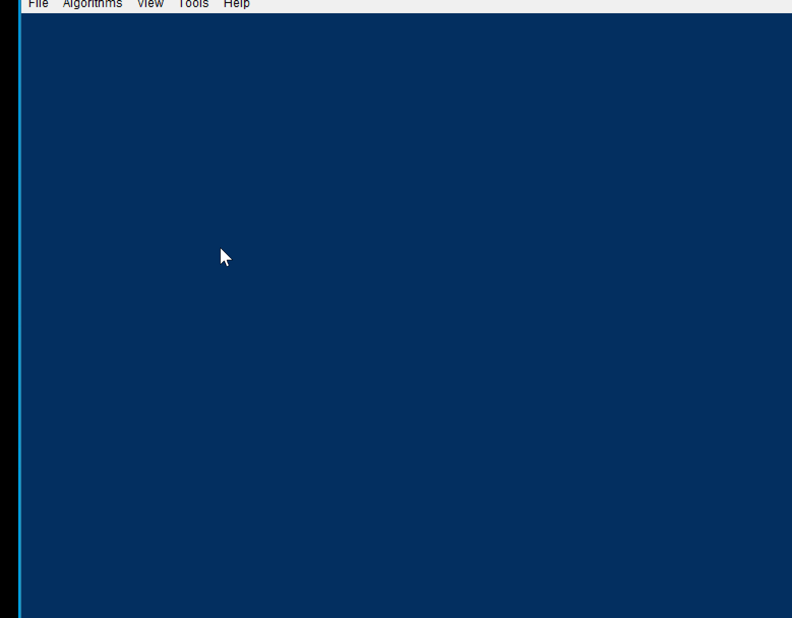

# Support-Vector-Machine

This was a team project. 
## My contribution:
* The <b>Input Data Generator <\b>
  + The generator of linear separable data sets, but with intentional errors for practical purposes.
* The implementation of the SMO algorithm
* The implementation of the FlexMargin algorithm for linear separable data sets that were measured with errors. 

## Demonstration:
* Generating data:

* Loading data:

* The Sequential Minimal Optimization algorithm put to work:
 

* The Flexible Margin algorithm put to work:

